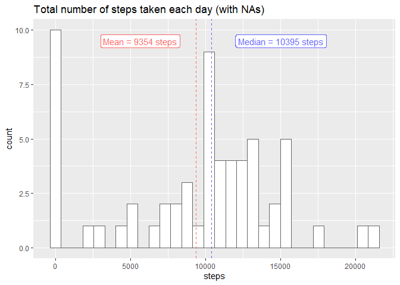
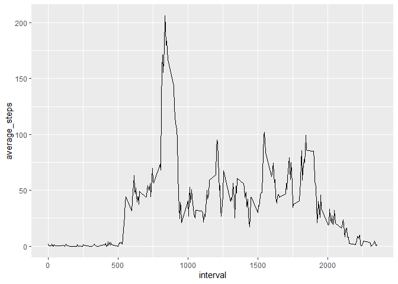
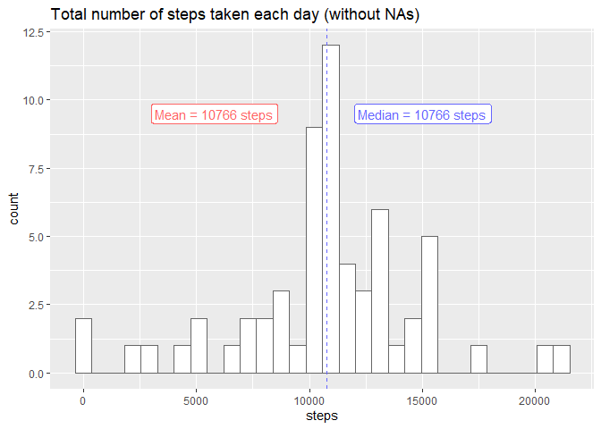
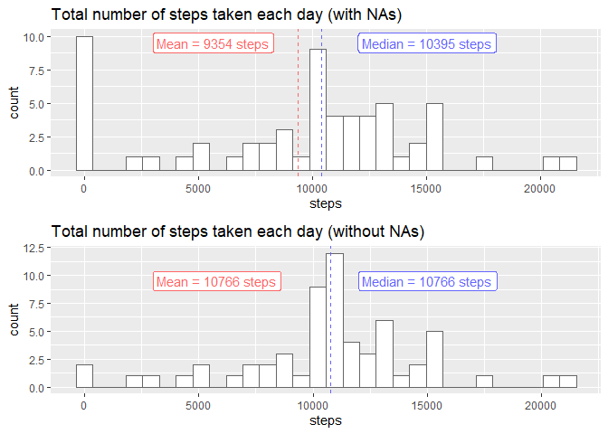
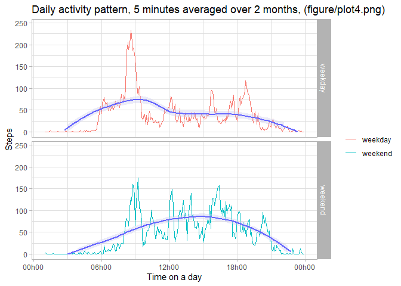

[My Git repo](https://github.com/PhilippeVarmeLiz/RepData_PeerAssessment1), forked from [rdpeng](https://github.com/rdpeng/RepData_PeerAssessment1)

## Loading Required Libraries

```r
library(dplyr)
library(ggplot2)
library(scales)
library(lubridate)
library(stringr)
library(knitr)
library(gridExtra)
```

## Loading and preprocessing the data

```r
data_zip_name <- "activity.zip"
data_folder <- "activity"

if(!dir.exists(data_folder)) {
  dir.create(data_folder, showWarnings = TRUE, recursive = FALSE, mode = "0744")
  unzip(data_zip_name, exdir = data_folder)
}

activity <- read.csv (paste(data_folder,"/activity.csv", sep=""), header=TRUE, sep = ",", dec=".")
activity$date <- as.Date(activity$date)
```

## What is mean total number of steps taken per day?
Grouping the data and getting the mean and median

```r
steps_per_day <- group_by(activity, date)
steps_per_day <- summarise(steps_per_day, steps = sum(steps, na.rm = TRUE))

mean_steps_per_day <- mean(steps_per_day$steps, na.rm = TRUE)
median_steps_per_day <- median(steps_per_day$steps, na.rm = TRUE)
```

Plot

```r
g <- ggplot(data = steps_per_day, aes(x = steps)) +
  geom_histogram(bins = 30, color = "#666666", fill = "white", show.legend = FALSE, na.rm = FALSE) +
  ggtitle("Total number of steps taken each day (with NAs)")

##Including mean line and label
g <- g +
  geom_vline(xintercept = mean_steps_per_day, linetype = "dashed",color = "#ff6666") +
  geom_label(x = 3000, y = 9.5, hjust = "left", 
              label = paste("Mean = ",round(mean_steps_per_day,0)," steps",sep=""),
              color="#ff6666")

##Including medain line and label
g <- g + 
  geom_vline(xintercept = median_steps_per_day, linetype = "dashed", color = "#6666ff") +
  geom_label(x = 12000, y = 9.5, hjust = "left",
                        label = paste("Median = ", round(median_steps_per_day,0), " steps", sep=""),
                        color="#6666ff")

print(g)
```

<!-- -->

## What is the average daily activity pattern?
Grouping by interval

```r
by_interval <- group_by(activity, interval)
by_interval <- summarise(by_interval, average_steps = mean(steps, na.rm = TRUE))
```

```
## `summarise()` ungrouping output (override with `.groups` argument)
```

Plot

```r
ggplot(data = by_interval, aes(x = interval, y = average_steps, na.rm = TRUE)) +
  geom_line()
```

<!-- -->

Which 5-minute interval, on average across all the days in the dataset, contains the maximum number of steps?

```r
by_interval[which.max(by_interval$average_steps), ]$interval
```

```
## [1] 835
```

## Imputing missing values
Calculate and report the total number of missing values in the dataset (i.e. the total number of rows with NAs)

```r
sum(is.na(activity$steps))
```

```
## [1] 2304
```

Devise a strategy for filling in all of the missing values in the dataset. The strategy does not need to be sophisticated. For example, you could use the mean/median for that day, or the mean for that 5-minute interval, etc.

```r
imputed_steps <- by_interval$average_steps[match(activity$interval, by_interval$interval)]
```

Create a new dataset that is equal to the original dataset but with the missing data filled in.

```r
activity_imputed <- transform(activity, steps = ifelse(is.na(activity$steps), yes = imputed_steps, no = activity$steps))
```

Make a histogram of the total number of steps taken each day and Calculate and report the mean and median total number of steps taken per day.

```r
steps_per_day_imputed <- group_by(activity_imputed, date)
steps_per_day_imputed <- summarise(steps_per_day_imputed, steps = sum(steps, na.rm = TRUE))

mean_steps_per_day_imputed <- mean(steps_per_day_imputed$steps, na.rm = TRUE)
median_steps_per_day_imputed <- median(steps_per_day_imputed$steps, na.rm = TRUE)

g_imputed <- ggplot(data = steps_per_day_imputed, aes(x = steps)) +
  geom_histogram(bins = 30, color = "#666666", fill = "white", show.legend = FALSE, na.rm = FALSE)  +
  ggtitle("Total number of steps taken each day (without NAs)")

##Including mean line and label
g_imputed <- g_imputed +
  geom_vline(xintercept = mean_steps_per_day_imputed, linetype = "dashed",color = "#ff6666") +
  geom_label(x = 3000, y = 9.5, hjust = "left", 
              label = paste("Mean = ",round(mean_steps_per_day_imputed,0)," steps",sep=""),
              color="#ff6666")

##Including medain line and label
g_imputed <- g_imputed + 
  geom_vline(xintercept = median_steps_per_day_imputed, linetype = "dashed", color = "#6666ff") +
  geom_label(x = 12000, y = 9.5, hjust = "left",
                        label = paste("Median = ", round(median_steps_per_day_imputed,0), " steps", sep=""),
                        color="#6666ff")

print(g_imputed)
```

<!-- -->

Do these values differ from the estimates from the first part of the assignment? What is the impact of imputing missing data on the estimates of the total daily number of steps?


```r
grid.arrange(g, g_imputed)
```

<!-- -->

## Are there differences in activity patterns between weekdays and weekends?


```r
activity_week_wise <- transform(activity, day_type = ifelse(wday(activity$date, week_start = 1) %in% c(6,7), yes = "weekend", no = "weekday"))

activity_week_wise_group <- group_by(activity_week_wise, interval, day_type)
activity_week_wise_group <- summarise(activity_week_wise_group, average_steps = mean(steps, na.rm = TRUE))

activity_week_wise_group$interval <- parse_date_time(activity_week_wise_group$interval, "HM") + months(9) + years(2012)

g <- ggplot(data = activity_week_wise_group, 
            aes(x = interval, y = average_steps, color = day_type, group = day_type)) +
  geom_line(show.legend = TRUE) + theme_light() +
  ylim(c(0,max(activity_week_wise_group$average_steps)*1.05)) +
  geom_smooth(method = "loess", color = "#6666ff", bg = "#ccccee") +
  ggtitle("Daily activity pattern, 5 minutes averaged over 2 months, (figure/plot4.png)") +
  ylab("Steps") + xlab("Time on a day") +
  scale_x_datetime(labels = date_format("%Hh%M")) + scale_color_discrete(name = "") +
  facet_grid(rows = vars(day_type))
  
print(g)
```

<!-- -->
